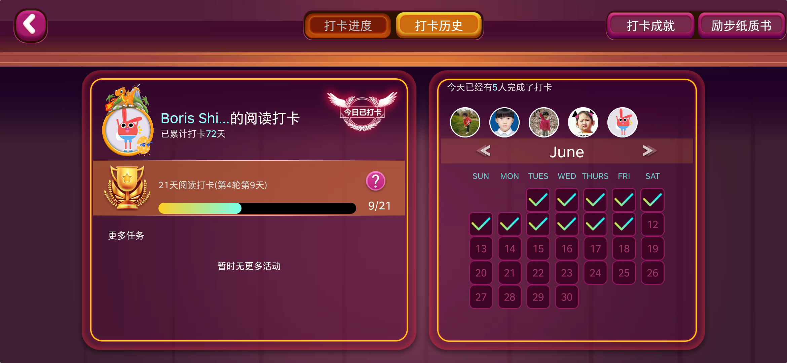

# fe-challenge

> **Jerry的前端大挑战**

## 01-first-leap-app

> 儿子的励步英语手机APP，这个APP日常使用极高，基本每天都要打开带儿子读英语绘本，有时候时间多一天读3~4本，目标是带儿子坚持365天读绘本，到了365天我就逃了，习惯应该养成了，不需要我陪读了。
>
> 用下来感觉此APP真算极品，产品力不是一般的强！

### 分析设计

- 自上而下看吧，首先搞顶部的5个按钮，可以抽为两大类按钮，其中大的横条按钮处理下颜色，对了按钮底下的凹还得一个组件，根据按钮宽度伸缩
- 顶部Nav下面的那个木质横条条竟然是渐变的
- 来到主体内容的左侧区域，用户头像外的那个外圈是个gif，可以喷火的小龙，底下个鸡蛋蹦个小鸡鸡出来就不做了，和喷火龙一样，搞一样意思在就行
- 右边的一打开扣个图片吧
- 下面奖杯倒是没啥，但是中间bnner底色竟然也是透明，等等左侧大框底色也是半透明
- 渐变条竟然是也是渐变的
- 任务区的话，过了时间没有了，看看后期会不会有，补上一个效果更好
- 到右侧区域，日历一个组件，小日期框框一个组件，等等，可以手写个日历系统，温习下js的Date类型，要得！
- 日历里的小框框的勾勾怎么实现？
  - 最底下那层深色，然后渐变色的勾勾咋办？拿clip-path的多边形徒手扣吗？怕不好，有点考验，倒也可以试试，其他法子真不好办到，用代码实现！
- 来到Tab2，进度条倒是好写
- 书本自底下的彩带有难度，好立体的感觉，有光、有阴影、还有裁边，我靠，那个光还是部分的，没全部照出来，有点难嘛，竟然还有点弯曲的感觉！！！
- 对了全局底图有个木板！

## 02-first-leap-share-h5

> 主要搞它的 `WebApp` 响应式布局，全局用 rem 做单位！

### 分析设计

- `html` 根元素字体默认 `100px`，则所有元素使用rem时 `1rem = 100px`
- 默认给html内的所有子子孙孙元素设置个默认 `font-size: .4rem;`
- 开始监听整个视窗的大小变化，默认 `WebApp` 的盒子最大宽度就是 `768px`，然后随着宽度变化按比例缩减 `html` 的 `font-size`
